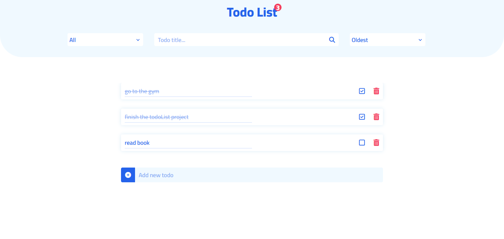

# TodoList

This is a TodoList project where you can add, delete and edit your todos. You can search among your todos and sort them by oldest and newest and also filter them by their status (completed-uncomplete).

---

## Contact Me

